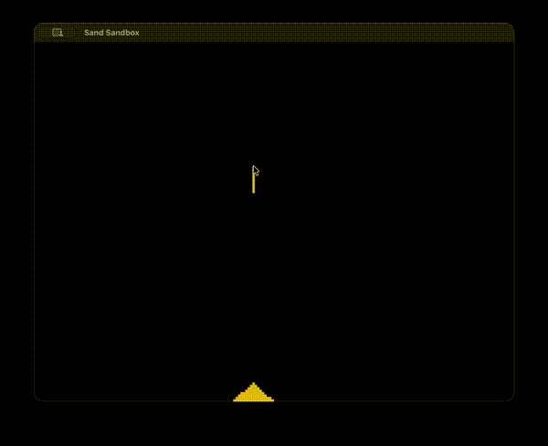

# Falling Sand Simulation

A real-time falling-sand simulation in C++ using raylib, inspired by wondering how games like Minecraft simulate falling sand and flowing water through 'Cellular Automata'.

## How it works

The simulation is based on cellular automata. Each grain of sand follows one simple rule every frame: try to fall straight down, and if that's blocked, try to slide down-left or down-right (chosen randomly to avoid directional bias). When all three are blocked, it settles — which is how piles form. Thousands of grains each following that tiny rule produce realistic pouring and piling, without any single grain knowing about the bigger picture.

The world is stored as a flat array of cells indexed as `y * COLS + x`, rather than a 2D array — simpler and faster to work with.

## What I learned / tricky parts

The hardest bug was sand teleporting straight to the floor instead of falling smoothly. The cause was scan order: processing the grid top-to-bottom meant a grain that fell got re-processed lower down in the same frame, dropping multiple rows at once. Iterating from the bottom row upward fixed it — a fallen grain lands in an already-processed row and waits for the next frame.

## Build and run

Requires [raylib](https://www.raylib.com/). On macOS:

\`\`\`bash
brew install raylib pkg-config
### To Run on macOS: 
clang++ main.cpp -o sandbox $(pkg-config --cflags --libs raylib) -framework OpenGL -framework Cocoa -framework IOKit
./sandbox
\`\`\`

Hold the left mouse button to pour sand.
